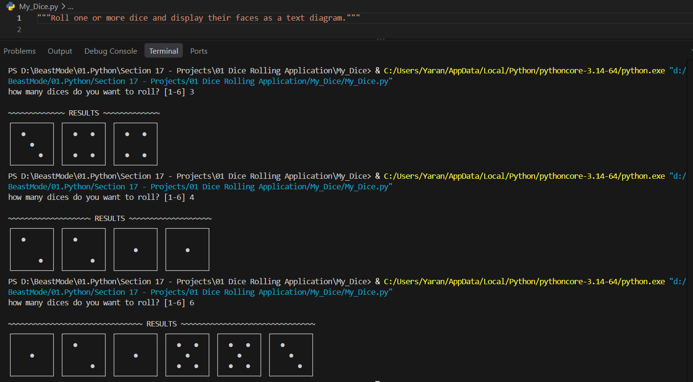

# 🎲 Dice Rolling Application

A simple **Python dice rolling application** that allows users to roll **1–6 dice** and displays the results as text-based dice faces.

## ✨ Features

* 🎲 Roll 1–6 dice
* 🔀 Random dice results using Python's `random` module
* 🖥️ Text-based dice face rendering
* ✅ Input validation
* 🧩 Modular functions for input, rolling, and display logic

## 🛠️ Tech Stack

* **Python 3**
* **random**
* **CLI / Terminal**
* **Unicode text rendering**

## 🚀 Getting Started

### Run the application

```bash
python dice.py
```

Choose how many dice you want to roll:

```text
how many dices do you want to roll? [1-6]
```

The application then generates and displays the dice results.

## 📸 Screen Shots



## 🧠 What I Explored

* Python functions and modular code
* User input and validation
* Random number generation
* Lists and loops
* Dictionary-based data structures
* Unicode/text-based terminal output

---

**Built by ARK13** — a Python project exploring randomness, functions, input handling, and terminal-based output.
